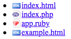

Добавить к каждой ссылке в списке  добавить с типом файла, на который она указывает(атрибут `href`). Можно менять только блок со стилями. [Файл с иконками тут](http://www.famfamfam.com/lab/icons/silk/previews/index_abc.png). Загружать его в репозиторий или модифицировать файл нельзя.

Список должен выглядеть так

