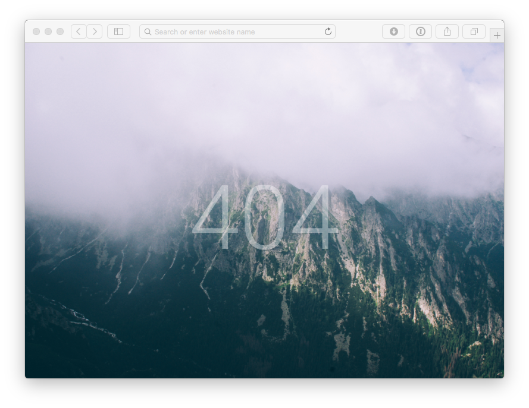

Надо реализовать красивую 404 страницу.

* [Фоновая картинка](https://static.pexels.com/photos/6923/mountains-fog-green-beauty.jpg) (её в репозиторий загружать не надо). Она должна заполнять весь экран, центрироваться и масштабироваться под его размеры.
* Текст должен отображаться по центру окна. Шрифт - `Roboto`(light 300). Цвет - `#fff`. Прозрачность - `30%` 

