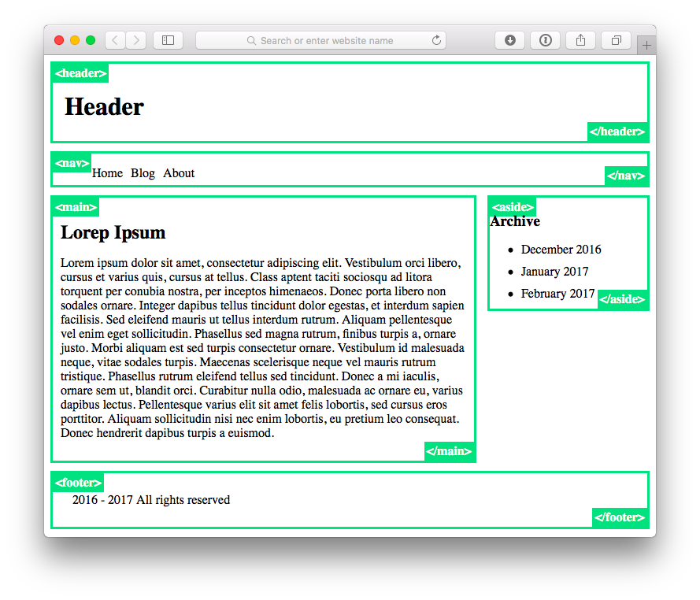

Только с помощью CSS сделать из HTML подобие страницы блога. 
Каждый важный(`header`, `nav`, `main`, `aside`, `footer`) элемент должен выделяться рамкой и выводить свой открывающий и закрывающий тег.

