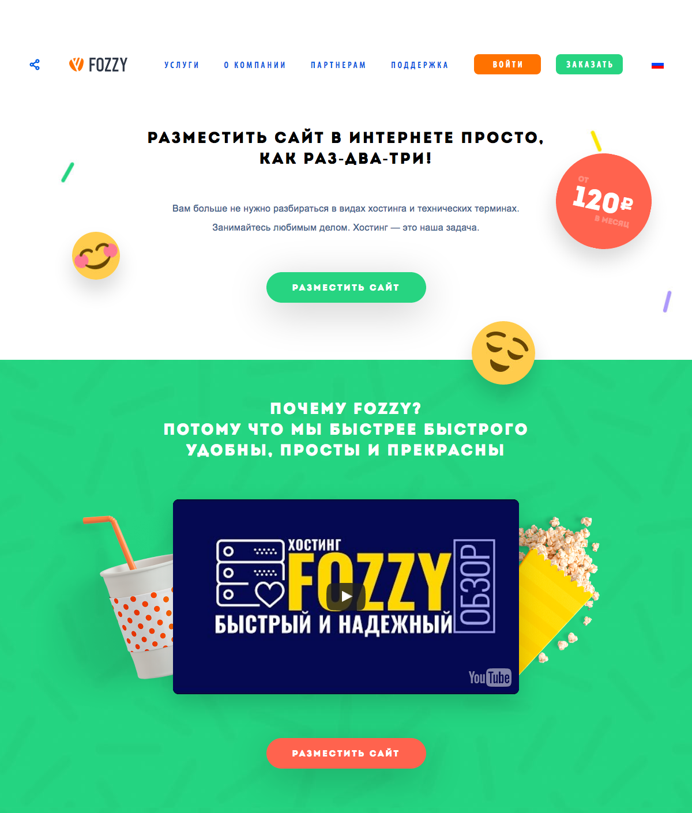

# Новая версия главной Fozzy
Надо сверстать новую версию главной страницы Fozzy.
Если какие-то папраметры не указываются, то они должны быть такими же, как для экрана меньшего размера. Например, для мобильной версии указывается размер шрифта заголовка, а для десктопа не указывается, то на десктопе он будет таким же.
Будет проверяться соответствие результата макету.

## Mobile (меньше 768 px)
### Текст
* Разместить сайт / Почему Fozzy? - `Intro` `21px`
* Вам больше не нужно ... - `Arial` `16px`
### Кнопки
* Текст - `Intro` `14px` ``#fff`
* Фон - `#27D481` и `#FF634E`
* Радиус - `27px`
* Тень - `0 15px 68px 0 rgba(0,0,0,0.2);`

### Ссылка на видео
[Обзор быстрого хостинга Fozzy ](https://www.youtube.com/watch?v=1JHvRJ5tSLg)

## Tablet (768 px и больше)

### Текст
* Разместить сайт / Почему Fozzy? - `24px`

### Кнопки
* Текст - `15px`

## Desktop  (1200 px и больше)

### Бейдж с ценой
Он должен быть реализован без использования картинок.

### Текст
* Разместить сайт / Почему Fozzy? - `27px`

### Меню
* Ссылки - `Myriad Pro Cond` `16px`, `#0f5ee0`(hover `#ff7200`)
* Кнопки
 * Текст - `Myriad Pro Cond` `16px`
 * Фон - `#ff7200` и `#27d481`
* Share. При наведении иконка должна менять цвет на оранжевый.

