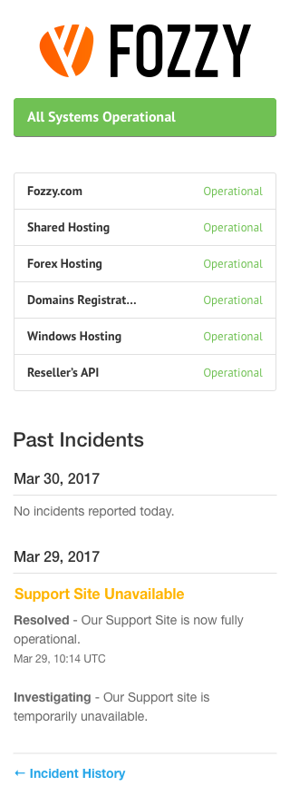
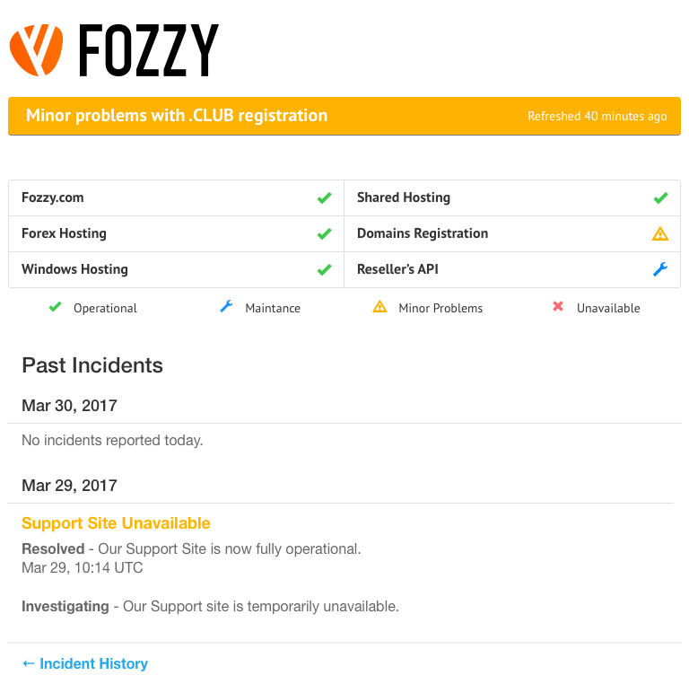

# Статус сервисов Fozzy
Надо сверстать страницу со статусами сервисов Fozzy используя Bootstrap. Имена сервисов и их статусы могут быть любыми. Главное, чтобы их было `6`.
Везде используется шрифт `PT Sans`.

## XS (меньше 768 px)

* Общий статус - `16px` `#fff`
* Название сервиса - `14px` `#333`
* Статус сервиса - `13px` цвет зависит от статуса
* Past Incidents - `22px` `#333`
* Дата - `16px` `#333`
* Support Site Unavailable - `16px` `#FFB400`
* Текст инцидента - `14px` `#555`

## SM (768 px и больше)

* Общий статус - `20px` `#fff`
* Время обновления - `14px` `#fff`
* Название сервиса - `16px` `#333`
* Иконка статус сервиса - `16px` цвет зависит от статуса
* Past Incidents - `24px` `#333`
* Дата - `18px` `#333`
* Support Site Unavailable - `18px` `#FFB400`
* Текст инцидента - `16px` `#555`
